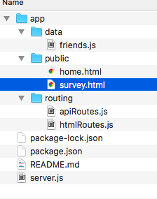

# FriendFinder
[Try the application here](https://warm-sands-98393.herokuapp.com/).
FriendFinder matches the user with a potential 'friend' based on how similarly they score on the survey. The friend with the closest value to the user will be the winning match. The user will see the recommendation pop onto the screen with the use of a bootstrap's modal.  

### Getting Started
To begin, I would recommend creating a 10 questions survey (and each question must be a scale from 1 to 5(1 being least likely, 5 being most likely). The only requirement is that each question as a scale of numeric choices. The questions must have a uniform feel with the way the user is inputting the data. This makes it easier for us to create the logic behind the applications recommendation. Open-ended questions, text answers or any other question form that does not fit the numeric scale format will skew the results or will stop the application from finishing the program and pairing the user with a new friend. 

I used bootstrap's form to quickly create my questions with a correspondng numeric scale(from 1-5), and a submit button on my survey.html file. 

### Prerequisites
This project utilizes Node.js, Express, and Body-Parser. You need to have Node.js installed on your computer before building this application. If you do not have Node.js already installed on your machine, you can use this [link](https://nodejs.org/en/). Once you have node.js you'll be able to start building your own friend finding application. 

### Installing
Once you're in your file that will hold your application, install your npm packages. You can build your folder from command line with `mkdir` function followed by the name of your folder. For example: `mkdir friendFinder` will create a folder called, "friendFinder". 
Next from terminal, move into the file with this command from terminal: `cd friendFinder`. 

Now that your are in your file. create the files you new to run this application. The `touch` command will create your file. 
Next, create your server.js file. This is file that will run and connect all of the pieces of this project to create a working application. You will have all of your routes and corresponding files and logic connected to this page to create this program. 

After you `touch server.js` make your app directory with the command `mkdir app`. Enter this fold with `cd app`. Now that you are in this file, repeat the earlier commands until you have a file/folder system that looks like the image below. all of your other files will be in your app directory. To move out of a file use the command `cd ../`, and to move out of two folders try `cd ../../`.

At this point, you should create your package.json file with the command `npm init`. This will give you create for creating this project and it will also continuously add your npm packages to it. This will help anyone looking to fork your project and recreate it. 
When you run the `npm init` command from command line, you will be ask a series of questions such as Project Name, the version of it, the repo, and the author. It's pretty self explanatory and easy to follow. 

Now you'll want to install your npm packages and finish setting up your environment. 
The two packages are express, and body-parser. User the commands `npm install express` and `npm install body-parser` respectively to add these packages to your folder. 

What do these do? Express allows you to build routes for your website. So any file you want to host on your server and whatever route you specify like "/", or  "/api", that hang off the domain are created by express. For more information on express.js, see the npm information [here](https://www.npmjs.com/package/express).

Body-parser allows us to send and recieve JSON objects to and from the server. For more information on this package, look [here](https://www.npmjs.com/package/body-parser).

### Building the application
Your environment is all set and ready to go! If you have not, build out your home.html and survey.html pages. I used [Bootstrap 4](https://getbootstrap.com/) to build my site. Remember to use the jQuery and other links from Bootstrap so that all button presses or animated function will work appropriately. 

Say what the step will be

Give the example
And repeat

until finished
End with an example of getting some data out of the system or using it for a little demo

Running the tests
Explain how to run the automated tests for this system

Break down into end to end tests
Explain what these tests test and why

Give an example
And coding style tests
Explain what these tests test and why

Give an example
Deployment
Add additional notes about how to deploy this on a live system

Built With
Dropwizard - The web framework used
Maven - Dependency Management
ROME - Used to generate RSS Feeds
Contributing
Please read CONTRIBUTING.md for details on our code of conduct, and the process for submitting pull requests to us.

Versioning
We use SemVer for versioning. For the versions available, see the tags on this repository.

Authors
Billie Thompson - Initial work - PurpleBooth
See also the list of contributors who participated in this project.

License
This project is licensed under the MIT License - see the LICENSE.md file for details

Acknowledgments
Hat tip to anyone whose code was used
Inspiration
etc
